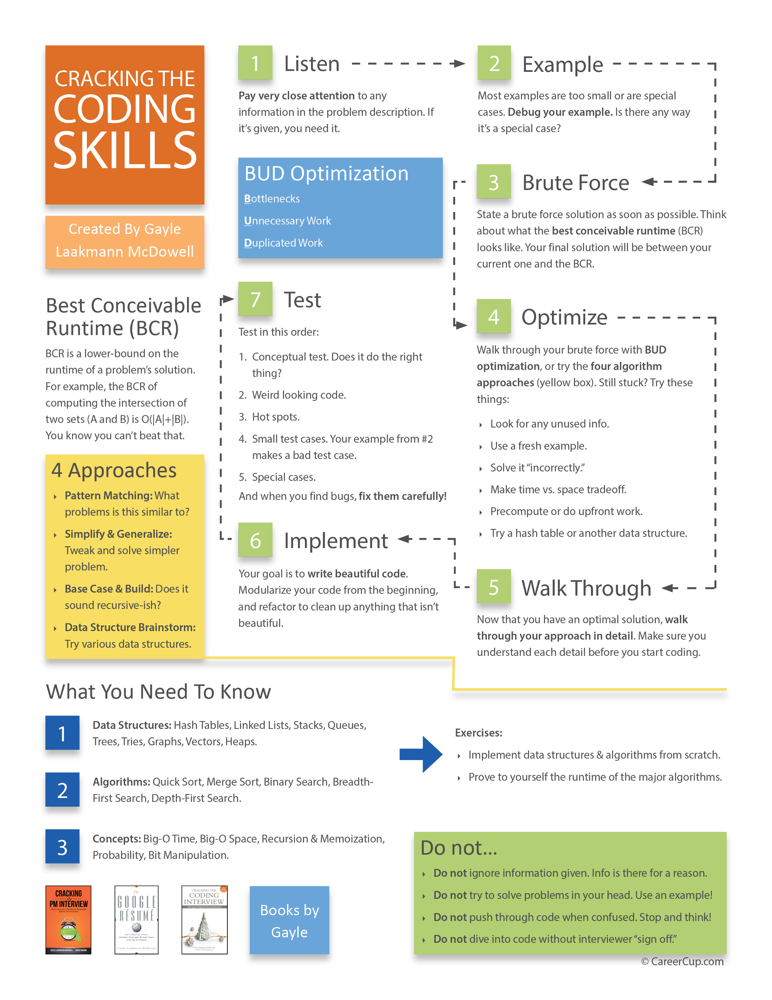



# Onsite Interviews & Whiteboarding

## Guest speakers: ACA alumni panel

Guest speakers (and ACA alumni) Rachael Thompson, Cynthia Williams, and Lisa Umhey will speak about their job search experience, followed by a Q&A session.

## Question of the day

During the Scrum Meeting, we'll go around the circle and everyone will have **one minute** to answer the following prompt:

* What coding project are you most proud of?
  * What does the project do?
  * What was your role in the project?
  * Explain 1-2 features/aspects that make it your favorite project.
  
Congratulations! You just completed a one-minute pitch for your favorite project!

## Onsite interviews

## What to wear & bring

Interview attire:
* For most tech companies, a full business suit is not necessary.
* Women:
  * Slacks/skirt paired with a blouse or button-down shirt
  * An office-appropriate dress
* Men:
  * Slacks and a button-down shirt
  * Blazer and tie are optional
* If you're interviewing with a company that's in an industry with a more formal dress code (business, consulting, law, etc) you may need to dress according to the norms for that industry, even though you're applying for a technical role.
* When in doubt, err on the side of dressing too formally!

Bring along:
* Copies of your resume, just in case
* Water bottle
* In some cases, employers will ask you to bring a laptop for technical interviews

## Interview day: What to expect

Onsite interviews can last anywhere between a few hours to a full day. You'll typically be met by a recruiter or someone from HR who will serve as your host for the day. They'll welcome you, perhaps give you a tour of the office, and spend a few minutes chatting about the plan for your visit. This is a great time to ask questions so you know what to expect.

Technical interview formats vary between companies. Some employers favor 1:1 coding interviews, while others will have 2 or 3 engineers interview the candidate at one time. Ask your host what to expect.

If your visit is scheduled for a full day, someone from the company will take you to lunch. This will likely be a product manager, team lead, or HR representative. Lunch hour will be more casual than the technical interviews, but remember that it is still an interview! Be prepared to talk about your reasons for applying to the company, your career goals, and the projects you've worked on.

At the end of your interview day, your host will typically have a closing chat with you to debrief and see how things went. This is a good time to ask about the next steps in the process.

After your onsite interviews, follow up with each interviewer by sending a brief thank-you email.

## Whiteboarding

Whiteboarding has a reputation for being the hardest part of the interview process. During whiteboarding interviews, the candidate stands in front of a white board and solves a coding problem while writing and talking out loud.

Why do employers include whiteboarding in the interview process?
Here are some goals of whiteboarding interviews:

* See how the candidate approaches tricky coding problems.
* Understand the candidate's thought process while solving problems.
* Test the candidate's communication skills. Can they communicate a technical solution to others? How do they communicate under pressure?
* Get a sense of what it's like to collaborate with the candidate on a technical problem.

Whiteboarding interview myths:

* You must correctly solve the coding question or they won't offer you a job.
  * FALSE. The goal of the interview is to see how you solve problems and communicate. While a correct solution to the problem certainly helps your case, don't despair if you run out of time or have a few bugs in your code. Many coding questions are designed to be too difficult and/or lengthy for the allotted interview time. In those cases, the interviewer simply wants to see how far you can get with the question.
  
* The code you write one the whiteboard must compile.
  * FALSE. While you should demonstrate that you understand the basic syntax of the language you're using, don't sweat it if you can't remember specific syntax details about built-in libraries (string methods, floor/ceiling functions, etc). The interviewer is more concerned about your approach to solving the overall problem.
  
### How to approach coding questions

Use this handy problem-solving flowchart from [Cracking the Coding Interview](http://www.crackingthecodinginterview.com/):

### Whiteboarding tips & tricks

* **Remember that the interviewer will ask for a quick intro.** Be prepared to give a technical summary of a favorite project, but keep it brief so it doesn't eat too much into your coding time. The interviewer may ask a few technical questions about your project and how it was implemented.

* **Don't worry about creating a perfect solution on the first try.** Articulate a working solution (even if it feels inefficient) and then iterate rather than immediately trying to jump to the clever solution. If you cannot explain your solution clearly in 5 minutes, it's probably too complex for the problem at hand.

* **Use pseudocode.** Don't get hung up on writing code with perfect syntax. The goal of the interview is to see how you think through problems, not to test your recollection of syntax rules. Use "pseudocode" - coding shorthand that explains what your solution is supposed to do. If you don't remember a function or method name, just make it up (eg. `lowerCase(word)`). You can even go as far as just [write what you expect each line to do](https://www.unf.edu/~broggio/cop2221/2221pseu.htm).

* **Keep talking.** As with any type of interview, your goal should be to turn the whiteboarding session into as much of a conversation as possible. Explain everything you're thinking and writing on the board to the interviewer. Even if you're feeling unsure about something, say so: "I'm not 100% sure an array is the best solution for this, but I'm going to give it a try because..." A good interviewer will give you hints and guide you towards the solution.

* **Ask questions.** Make sure you are asking clarifying questions as you go along, to make sure you have the information you need to create a solution. The interviewer will often give you hints or indicate if you're headed in the right direction.

* **Test, test, test.** The interviewer will expect you to test and debug your code. Think about edge/corner cases. For example, what happens if the input is null?

* **The interviewer wants you to succeed.** If an employer has invited you onsite for a round of technical interviews, they've already invested a lot of energy on you and think you're a good fit for the role. Your interviewer's job is not to grill you, but to see how you'd interact and solve problems as a member of their team. This is also an opportunity to see if you enjoy working with them.

* **Come prepared with questions for your interviewer.** This is just as much a chance for you to ensure that the company is the place you want to be.

### Whiteboarding practice problems

* [ACA whiteboard challenge questions](https://github.com/ACA-Alumni/ACA-Job-Tracker/tree/master/resources/whiteboard-challenges) - from the 2018 version of this class (click on any of the `.md` files to view the question)

## Interviewing resources

Books:
* [Cracking the Coding Interview](http://www.crackingthecodinginterview.com/) - the gold standard for technical interview prep
* [Programming Interviews Exposed](https://www.amazon.com/Programming-Interviews-Exposed-Through-Interview/dp/111941847X/ref=dp_ob_title_bk)
* [Code Complete](https://en.wikipedia.org/wiki/Code_Complete) - reference book

General interview prep:
* [Tech Interview Handbook](https://yangshun.github.io/tech-interview-handbook/) - free online resource by Yangshun Tay, a front-end engineer at Facebook
* [CodeWars](https://www.codewars.com/) - coding challenges
* [HackerRank](https://www.hackerrank.com/) - coding interview practice
* [Facebook Hiring Process](https://www.facebook.com/careers/life/preparing-for-your-software-engineering-interview-at-facebook)
* [FizzBuzz whiteboarding example (YouTube video)](https://www.youtube.com/watch?v=7IbxzIyRMrA)
* [InterviewCake](https://www.interviewcake.com/) - free interview resources that breaks down solutions into step-by-step chunks
* [HiredInTech’s System Design Section](https://www.hiredintech.com/system-design/) - guide for system design interview questions
* [Coderust](https://www.educative.io/collection/5642554087309312/5679846214598656) - $59 app that presents coding problems and solutions in almost any programming language, with interactive diagrams
* [Reddit’s How to Prepare for Tech Interviews](https://www.reddit.com/r/cscareerquestions/comments/1jov24/heres_how_to_prepare_for_tech_interviews/)
* [Leetcode](https://leetcode.com/) - the go-to resource for algorithm and data structure questions. You can filter by company, so for example, you could get all the questions that Uber or Google typically ask.

Front-end resources:
* [That JS Dude - Interview Questions for Front-End Developers](http://www.thatjsdude.com/interview)
* [Front End Interview Handbook](https://github.com/yangshun/front-end-interview-handbook)
* [Front End Interview Questions](https://github.com/h5bp/Front-end-Developer-Interview-Questions) - an exhaustive list of front-end questions

JavaScript resources:
* [Essential JavaScript Interview Questions](https://www.toptal.com/javascript/interview-questions)
* [CodeMentor Essential JavaScript Interview Questions](https://www.codementor.io/nihantanu/21-essential-javascript-tech-interview-practice-questions-answers-du107p62z)
* [Front End Interview Handbook: JS Questions](https://github.com/yangshun/front-end-interview-handbook/blob/master/questions/javascript-questions.md)

React resources:
* [React Interview Questions](https://tylermcginnis.com/react-interview-questions/)
* [Essential React Interview Questions](https://www.toptal.com/react/interview-questions)
* [Top 50 React Interview Questions](https://www.edureka.co/blog/interview-questions/react-interview-questions/)

.NET resources:
* [17 Essential .NET Interview Questions](https://www.toptal.com/dot-net/interview-questions)

## Homework (optional, but highly recommended!)

* **Part 1:** Research onsite interview formats for the companies you're interested in. The [Tech Interview Handbook](https://yangshun.github.io/tech-interview-handbook/company-interview-formats) is a good place to start - it covers onsite interview formats for some of the most popular companies (Google, Facebook, Dropbox, etc). For smaller companies, look on job search forums and blogs - you may be able to find some clues about what to expect during the onsite interview process.

* **Part 2:** Get yourself a copy of [Cracking the Coding Interview], the gold standard for technical interview prep. [Austin Public Library](https://austin.bibliocommons.com/item/show/1106616067) has 8 copies available. If you would like to purchase a copy, BookPeople in downtown Austin usually has a few copies in stock, or they will happily order it for you if it's sold out.
  * Once you have your copy, read Section VII (Technical Questions). It's a great summary of what to expect in technical interviews and how to prepare.
  
* **Part 3:** Develop a plan of action and start practicing! Plan to practice coding questions on a frequent, regular basis. Set aside time every day to practice your technical interview skills. Using the resources above, gather a list of questions to use as practice material and schedule out time to tackle each question.


